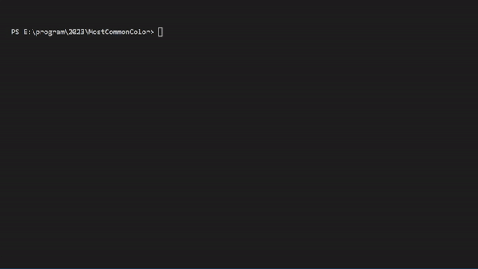

# The Most Common Color Project

This projects allows you to get the basic information about colors in pictures

It allows you to find:
- Total numebr of pixels
- The sum of the values of all red, green, and blue pixels
- The average color on RBG format
- The average color in hexadecimal format

 

The idea of creating this program appeared when I wanted to change the main Windows color based on my new wallpaper. I decided to write this program to find the most accurate color that would represent the average of all pixels in that image.

The program prompts the user for the local path to the image, calculates and outputs the information, and asks if the user wants to try another image

 

The project has a potential to scale by adding GUI, creating .exe file that can be run without python, and calculating more statistical information, such as the median color, the darkest and lightest pixels

 

